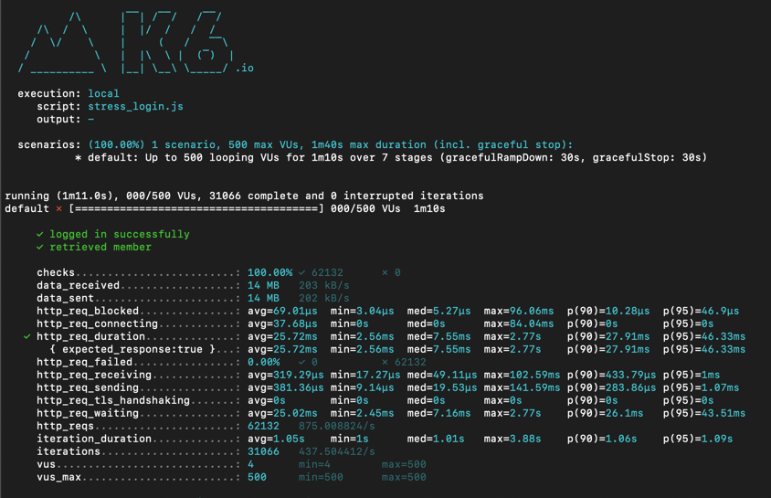
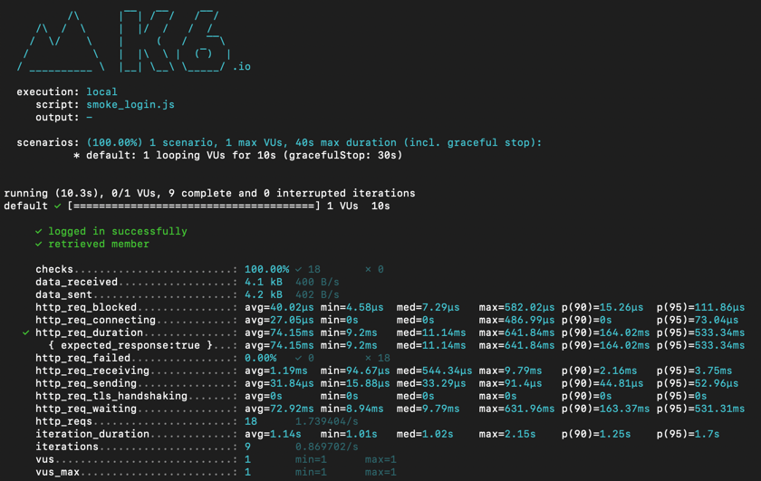

<p align="center">
    
</p>
<p align="center">
  
  
  <a href="https://edu.nextstep.camp/c/R89PYi5H" alt="nextstep atdd">
    
  </a>
  
</p>

<br>

# 인프라공방 샘플 서비스 - 지하철 노선도

<br>

## 🚀 Getting Started

### Install
#### npm 설치
```
cd frontend
npm install
```
> `frontend` 디렉토리에서 수행해야 합니다.

### Usage
#### webpack server 구동
```
npm run dev
```
#### application 구동
```
./gradlew clean build
```
<br>

## 미션

* 미션 진행 후에 아래 질문의 답을 작성하여 PR을 보내주세요.

### 1단계 - 화면 응답 개선하기
1. 성능 개선 결과를 공유해주세요 (Smoke, Load, Stress 테스트 결과)

- K6 개선 전 테스트 결과 
    - Smoke 결과 
        
    - Load 결과
        
    - Stress 결과
        
      
- K6 개선 후 테스트 결과
    - Smoke 결과
      
    - Load 결과
      
    - Stress 결과
      

2. 어떤 부분을 개선해보셨나요? 과정을 설명해주세요
- [X] 리버스 Proxy 개선하기
    - [X] CPU Core에 맞는 적절한 Worker 프로세스 할당
    - [X] http 수준에서 gzip 압축 활성화 
      ~~~
      text/plain text/css application/json application/x-javascript application/javascript text/xml application/xml application/rss+xml text/javascript image/svg+xml application/vnd.ms-fontobject application/x-font-ttf font/opentype;
      ~~~
    - [X] 캐시 유지 기간 10분 설정
    - [X] 전체 캐시 크기 200MB 설정
    - [X] 캐시 구분을 위한 Key 규칙 설정
    - [X] Connection이 적은 요청 분배 설정 (8080, 8081 포트로 나눠져서 Request 분배)
    - [X] http 로드 금지 
    - [X] access log 찍지 않기 설정
    - [X] http2 계층 위에서 동작하기 설정
    
- [X] WAS 성능 개선하기
    - [X] Redis를 이용한 Cache 이용
    - [X] MemberService Cache 적용  
    - [X] MemberResponse Json Serialization 적용
    
---

### 2단계 - 조회 성능 개선하기

- 2단계 요구사항 정리
    - 인덱스 적용해보기 요구사항
        - [ ] 주어진 데이터셋을 활용하여 아래 조회 결과를 100ms 이하로 반환
            - [ ] Coding as a Hobby 와 같은 결과를 반환하세요.
            - [ ] 프로그래머별로 해당하는 병원 이름을 반환하세요. (covid.id, hospital.name)
            - [ ] 프로그래밍이 취미인 학생 혹은 주니어(0-2년)들이 다닌 병원 이름을 반환하고 user.id 기준으로 정렬하세요. (covid.id, hospital.name, user.Hobby, user.DevType, user.YearsCoding)
            - [ ] 서울대병원에 다닌 20대 India 환자들을 병원에 머문 기간별로 집계하세요. (covid.Stay)
            - [ ] 서울대병원에 다닌 30대 환자들을 운동 횟수별로 집계하세요. (user.Exercise)
    - 즐겨 찾기 페이징 요구사항
        - [ ] 즐겨찾기 페이지에 페이징 쿼리 적용
            - [ ] 로그인한 사용자는 최근에 추가한 즐겨찾기만 관심이 있기에 한번에 5개의 즐겨찾기만 보고 싶다.
    - 데이터 베이스 이중화 요구사항
        - [ ] 데이터 베이스 이중화

1. 인덱스 적용해보기 실습을 진행해본 과정을 공유해주세요

~~~SQL


# - [ ] Coding as a Hobby 와 같은 결과를 반환하세요.

ALTER TABLE `subway`.`programmer` 
ADD INDEX `HOBBY` (`hobby` ASC);

SELECT (Count(hobby) / (SELECT COUNT(hobby) FROM subway.programmer) * 100) as 'HobbyCount' 
FROM subway.programmer
GROUP BY hobby; 
#after 0.054sec Full Index scan 


# - [ ] 프로그래머별로 해당하는 병원 이름을 반환하세요. (covid.id, hospital.name)
SELECT C.id, hospital.name 
FROM subway.covid AS C
JOIN subway.hospital 
ON hospital.id = C.hospital_id
WHERE C.id >= 1000
LIMIT 0, 10; # 0.026sec hostipal Full Table Scan / covid Full Table Scan

ALTER TABLE `subway`.`covid` 
ADD INDEX `COVID_ID_INDEX` (`id` ASC);

SELECT Covid.id, hospital.name 
FROM subway.covid AS Covid
JOIN subway.hospital 
ON hospital.id = Covid.hospital_id
WHERE Covid.id >= 1000
LIMIT 0, 10; # 0.0.13sec hostipal Full Table Scan / covid Index Range Scan

ALTER TABLE `subway`.`hospital` 
ADD INDEX `HOSPITAL_ID_INDEX` (`id` ASC);

SELECT Covid.id, Hospital.name 
FROM subway.covid AS Covid
JOIN subway.hospital AS Hospital
ON Hospital.id = Covid.hospital_id
WHERE Covid.id >= 1000
LIMIT 0, 10; # 0.0.14sec hostipal Non-Unique Key Lookup / covid Index Range Scan

#- [ ] 프로그래밍이 취미인 학생 혹은 주니어(0-2년)들이 다닌 병원 이름을 반환하고 user.id 기준으로 정렬하세요. (covid.id, hospital.name, user.Hobby, user.DevType, user.YearsCoding

SELECT  Covid.id, Hospital.name, Programmer.hobby, Programmer.dev_type, Programmer.years_coding
FROM    subway.covid Covid
JOIN    subway.hospital Hospital
ON      Covid.hospital_id = Hospital.id
JOIN    (
        SELECT 	id, hobby, dev_type, years_coding
        FROM    subway.programmer
        WHERE	(student = 'Yes' OR	years_coding = '0-2 years')
        AND		hobby = 'Yes'
        )  Programmer
ON      Covid.programmer_id = Programmer.id
WHERE	Covid.id >= 1000
LIMIT 0, 10; #After 0.026sec covid Index Range Scan / hosptital Non-Unique Key Lookup / programmer Non-Unique Key Lookup

#- [ ] 서울대병원에 다닌 20대 India 환자들을 병원에 머문 기간별로 집계하세요. (covid.Stay)

ALTER TABLE `subway`.`member` 
CHANGE COLUMN `id` `id` INT(11) NOT NULL ,
ADD PRIMARY KEY (`id`);

ALTER TABLE `subway`.`hospital` 
CHANGE COLUMN `id` `id` INT(11) NOT NULL ,
ADD PRIMARY KEY (`id`);

ALTER TABLE `subway`.`covid` 
CHANGE COLUMN `id` `id` INT(11) NOT NULL ,
ADD PRIMARY KEY (`id`);

ALTER TABLE `subway`.`programmer` 
CHANGE COLUMN `id` `id` INT(11) NOT NULL ,
ADD PRIMARY KEY (`id`);

ALTER TABLE `subway`.`programmer` 
ADD INDEX `COUNTRY` (`country` ASC);

ALTER TABLE `subway`.`programmer` 
ADD INDEX `MEMBER_ID` (`member_id` ASC);

ALTER TABLE `subway`.`covid` 
ADD INDEX `COVID_HOSPITAL_ID` (`hospital_id` ASC);


SELECT Covid.stay, COUNT(Covid.id)
FROM subway.hospital AS Hospital
         JOIN ( 
			SELECT hospital_id, id, stay
            FROM subway.covid 
            ) AS Covid 
            ON Hospital.id = Covid.hospital_id
         JOIN ( 
			SELECT id 
            FROM subway.programmer 
            WHERE country = 'India'
            ) AS Programmer 
            ON Programmer.id = Covid.id
         JOIN (
			 SELECT id 
			 FROM subway.member 
             WHERE age 
             BETWEEN 20 AND 29 
             ) AS Member 
             ON Member.id = Covid.id
WHERE Hospital.name = '서울대병원'
GROUP BY Covid.stay; # 0.098sec   


#- [ ] 서울대병원에 다닌 30대 환자들을 운동 횟수별로 집계하세요. (user.Exercise)

SELECT  exercise, count(Programmer.id) 
FROM    subway.programmer as Programmer
JOIN    (   
        SELECT  id   
        FROM    subway.member   
        WHERE   age BETWEEN 30 AND 39   
        ) Member 
ON      Programmer.member_id = Member.id 
JOIN    (   
        SELECT  covid.id   
        FROM    subway.covid 
        JOIN    (     
                SELECT  id     
                FROM    subway.hospital     
                WHERE   name = '서울대병원'     
                ) Hospital   
        ON      hospital_id = Hospital.id         
        ) Covid 
ON      Programmer.id =  Covid.id 
GROUP   BY Programmer.exercise; # 0.044sec
~~~

2. 페이징 쿼리를 적용한 API endpoint를 알려주세요

